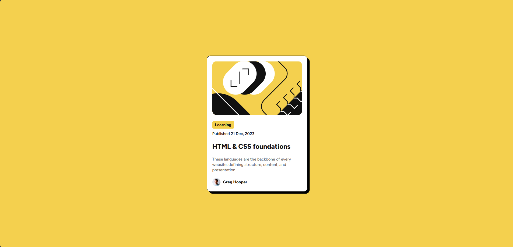

# Frontend Mentor - Blog preview card solution

This is a solution to the [Blog preview card challenge on Frontend Mentor](https://www.frontendmentor.io/challenges/blog-preview-card-ckPaj01IcS). Frontend Mentor challenges help you improve your coding skills by building realistic projects.

## Table of contents

- [Overview](#overview)
  - [The challenge](#the-challenge)
  - [Screenshot](#screenshot)
  - [Links](#links)
- [My process](#my-process)
  - [Built with](#built-with)
  - [What I learned](#what-i-learned)
  - [Continued development](#continued-development)
  - [Useful resources](#useful-resources)
- [Author](#author)
- [Acknowledgments](#acknowledgments)

## Overview

### The challenge

Users should be able to:

- See hover and focus states for all interactive elements on the page

### Screenshot



### Links

- Solution URL: [Github Repository](https://github.com/The-Lone-Druid/Blog-preview-card)
- Live Site URL: [Deployed URL](https://the-lone-druid.github.io/Blog-preview-card/)

## My process

### Built with

- Semantic HTML5 markup
- CSS custom properties
- Flexbox
- CSS Grid
- Mobile-first workflow
- [Tailwind CSS](https://tailwindcss.com/) - Tailwind CSS Library

### What I learned

- Learned how to use Tailwind CSS to quickly style components with utility-first classes.
- Built complex layouts using Flexbox and CSS Grid with Tailwind CSS.
- Enhanced user experience by implementing responsive design and interactive states.
- Explored Tailwind CSS core features such as theming and customizing the design system.
- Improved development speed and maintainability by leveraging Tailwind CSS's utility classes.

To see how you can add code snippets, see below:

```html
<body class="bg-yellow">
  <main class="h-screen w-screen flex items-center justify-center">
    <div
      class="bg-white p-4 rounded-xl shadow-custom max-w-[300px] border border-black flex flex-col gap-4"
    >
      <div>
        
      </div>
      <div>
        <span
          class="py-1 px-2 rounded font-[800] text-gray-950 bg-yellow text-xs"
        >
          Learning
        </span>
        <p class="mt-2 text-xs font-[500] text-gray-950">
          Published 21 Dec, 2023
        </p>
      </div>
      <div>
        <h1
          class="font-[800] text-gray-950 text-xl hover:text-yellow transition-all cursor-pointer"
        >
          HTML & CSS foundations
        </h1>
      </div>
      <div>
        <p class="text-xs text-gray-500">
          These languages are the backbone of every website, defining structure,
          content, and presentation.
        </p>
      </div>
      <div class="flex items-center gap-2">
        
        <span class="text-xs text-gray-950 font-[800]">Greg Hooper</span>
      </div>
    </div>
  </main>
</body>
```

```html
<!--Tailwind CSS Theming-->
<script>
  tailwind.config = {
    theme: {
      extend: {
        boxShadow: {
          custom: "6px 6px 0px 0px rgb(0, 0, 0)",
        },
        fontSize: {
          paragraph: "0.9375rem",
        },
        fontFamily: {
          sans: ["Figtree", "sans-serif"],
        },
        colors: {
          yellow: "hsl(47, 88%, 63%)",
          white: "hsl(0, 0%, 100%)",
          gray: {
            500: "hsl(0, 0%, 42%)",
            950: "hsl(0, 0%, 7%)",
          },
        },
      },
    },
  };
</script>
```

### Continued development

- Deepening understanding of Tailwind CSS and its advanced features.
- Exploring more complex CSS Grid and Flexbox layouts.
- Improving JavaScript skills to add more interactivity to projects.
- Learning about accessibility best practices to make projects more inclusive.
- Experimenting with new design tools and frameworks to enhance the development workflow.
- Continuously improving responsive design techniques for better user experiences on all devices.
- Enhancing performance optimization skills to create faster and more efficient web applications.
- Keeping up-to-date with the latest web development trends and technologies.

## Author

- Website - [Zahid Shaikh](https://www.zahidshaikh.space)
- Frontend Mentor - [@The-Lone-Druid](https://www.frontendmentor.io/profile/The-Lone-Druid)
- Github - [The-Lone-Druid](https://www.github.com/The-Lone-Druid)

**Note: Delete this note and add/remove/edit lines above based on what links you'd like to share.**

## Acknowledgments

This is where you can give a hat tip to anyone who helped you out on this project. Perhaps you worked in a team or got some inspiration from someone else's solution. This is the perfect place to give them some credit.

**Note: Delete this note and edit this section's content as necessary. If you completed this challenge by yourself, feel free to delete this section entirely.**
